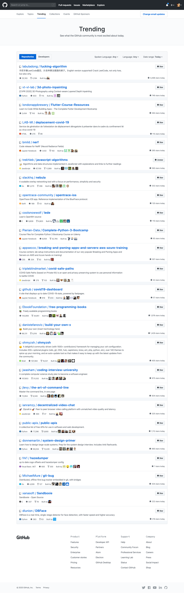

+++
title = "S011《Github趋势榜》了解Github当前最受关注的项目"
description = "直达链接: Github的Trending页面,相当于Github的首页推荐,github会把过去24小时,最受关注的的仓库,展现到这个页面; 当年风靡一时的996.icu,曾在这个页面霸榜一周,获得了全世界程序员的关注 当然这个榜单也经常会出现一些福利项目,比如某互联网公司的源码,或国内某著名搜索"
weight = 989
date = "2020-06-11"
categories = ["宝藏网站"]
tags = ["宝藏网站", "资源网站"]
aliases = ["/S011_github_trending.md", "/S011_github_trending/", "/docs/S011_github_trending.md"]
+++

## 直达链接: [https://github.com/trending](https://github.com/trending)

Github的Trending页面,相当于Github的首页推荐,github会把过去24小时,最受关注的的仓库,展现到这个页面;

当年风靡一时的996.icu,曾在这个页面霸榜一周,获得了全世界程序员的关注

当然这个榜单也经常会出现一些福利项目,比如某互联网公司的源码,或国内某著名搜索公司网盘的破解版,有时候甚至会出现一些颜色网站的爬虫,每日查看Github Trending榜,每日一个超神小技巧
