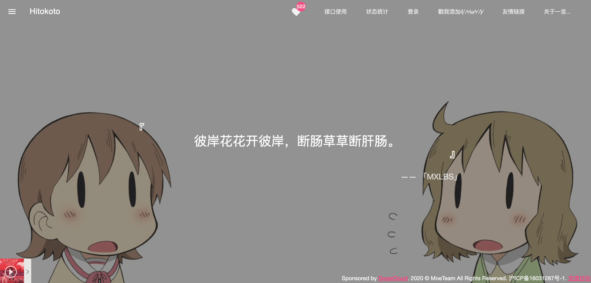
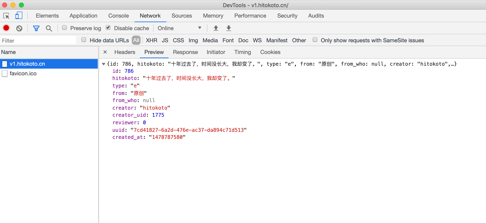
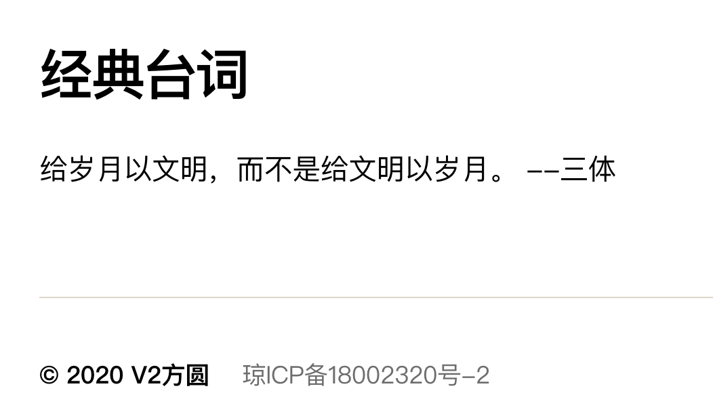

+++
title = "S013《一言》总有那么几个句子能穿透你的心"
description = "直达链接: 打开网页就会随机弹出一句触动心灵的句子 网站提供了第三方接口,任何人可以通过接口 获取一句话 也可以引用到自己到网站 效果: 代码块:"
weight = 987
date = "2020-06-13"
categories = ["宝藏网站"]
tags = ["宝藏网站", "资源网站"]
aliases = ["/S013_hitokoto.md", "/S013_hitokoto/", "/docs/S013_hitokoto.md"]
+++

## 直达链接: [https://hitokoto.cn/](https://hitokoto.cn/)


**打开网页就会随机弹出一句触动心灵的句子**



网站提供了第三方接口,任何人可以通过接口`https://v1.hitokoto.cn/`获取一句话




也可以引用到自己到网站

效果:



代码块:

```javascript
    <script
      src="https://cdnjs.cloudflare.com/ajax/libs/jquery/3.5.0/jquery.min.js"
      integrity="sha256-xNzN2a4ltkB44Mc/Jz3pT4iU1cmeR0FkXs4pru/JxaQ="
      crossorigin="anonymous"
    ></script>

    <div id="yiyan"></div>

    <script>
      jQuery
        .ajax({ url: "https://v1.hitokoto.cn/" })
        .done(function(content, err) {
          console.log("content::", content, "err::", err);
          if (err === "success") {
            var result = "";
            content = JSON.parse(content);
            result = content.hitokoto + "&nbsp;--" + content.from;
            console.log("=result=>>", result);
            result = content.hitokoto + "&nbsp;--" + content.from;
            jQuery("#yiyan").html(result);
          }
        });
    </script>
```
