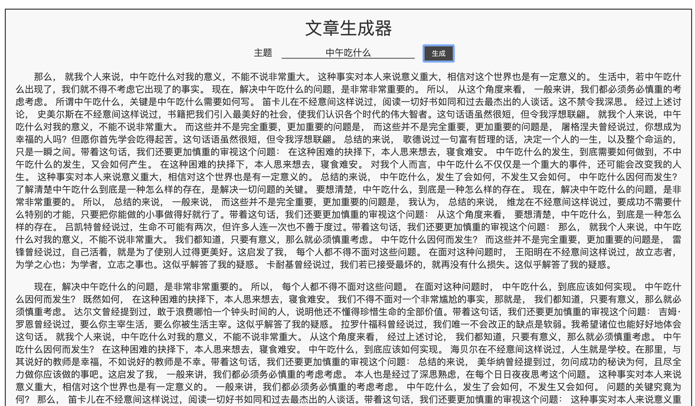

+++
title = "S018《狗屁不通文章生成器》根据关键词生成一篇文章"
description = "直达链接: 以世界级难题「中午吃什么」为例，生成一篇文章 这个网页由github开源项目「狗屁不通文章生成器」改造而来,开源地址: 据说开发这个程序的缘由,是作者想要搞个学生会退会,但被要求写几万字的申请,于是直接搞了个程序生成,但开发出来之后,发现文章确实「狗屁不通」,于是只好作为测试打印机是否正"
weight = 982
date = "2020-06-18"
categories = ["宝藏网站"]
tags = ["宝藏网站", "资源网站"]
aliases = ["/S018_bull_shit_generator.md", "/S018_bull_shit_generator/", "/docs/S018_bull_shit_generator.md"]
+++

## 直达链接: [https://suulnnka.github.io/BullshitGenerator/index.html](https://suulnnka.github.io/BullshitGenerator/index.html)

以世界级难题「中午吃什么」为例，生成一篇文章

这个网页由github开源项目「狗屁不通文章生成器」改造而来,开源地址:https://github.com/menzi11/BullshitGenerator

据说开发这个程序的缘由,是作者想要搞个学生会退会,但被要求写几万字的申请,于是直接搞了个程序生成,但开发出来之后,发现文章确实「狗屁不通」,于是只好作为测试打印机是否正常工作的程序

由于这个项目娱乐性较强，于是被大家争相传播
