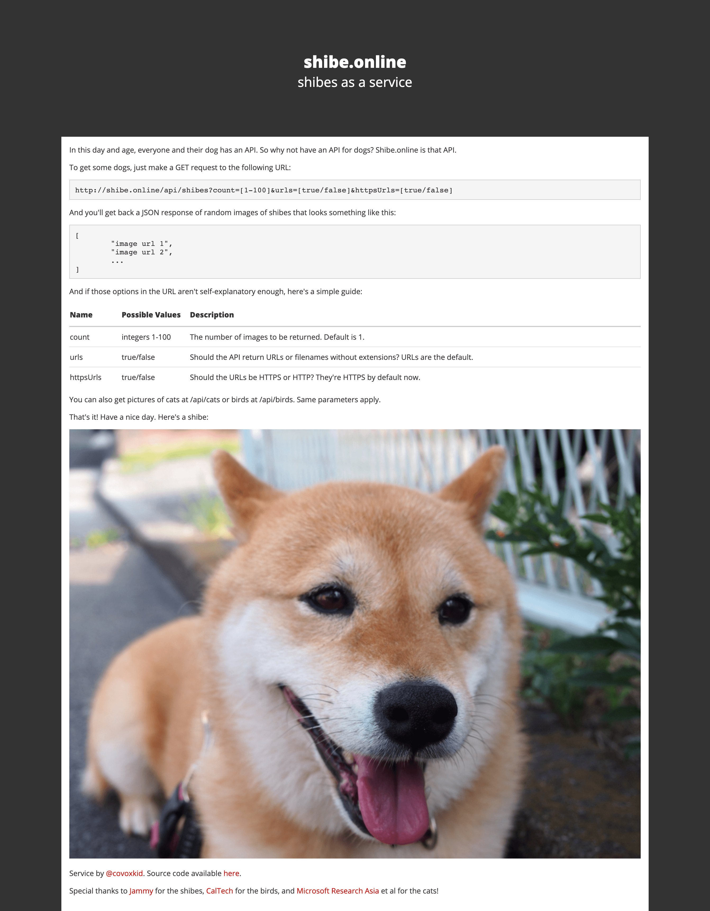

+++
title = "S024《狗站》随机获取一只狗狗图片"
description = "直达链接: 每次刷新网页，都会自动出现一只狗狗的照片，这简直是爱狗人士的福利吖（这就是云撸狗!）～ 这个网站提供了狗狗图片的api服务， 用GET方法请求(浏览器打开也可以) 以下url 即可收到带有100张狗狗图片的数组"
weight = 976
date = "2020-06-24"
categories = ["宝藏网站"]
tags = ["宝藏网站", "资源网站"]
aliases = ["/S024_shibe_online.md", "/S024_shibe_online/", "/docs/S024_shibe_online.md"]
+++

## 直达链接: [https://shibe.online/](https://shibe.online/)

每次刷新网页，都会自动出现一只狗狗的照片，这简直是爱狗人士的福利吖（这就是云撸狗!）～

这个网站提供了狗狗图片的api服务， 用GET方法请求(浏览器打开也可以) 以下url

http://shibe.online/api/shibes?count=100&urls=true&httpsUrls=true

即可收到带有100张狗狗图片的数组

