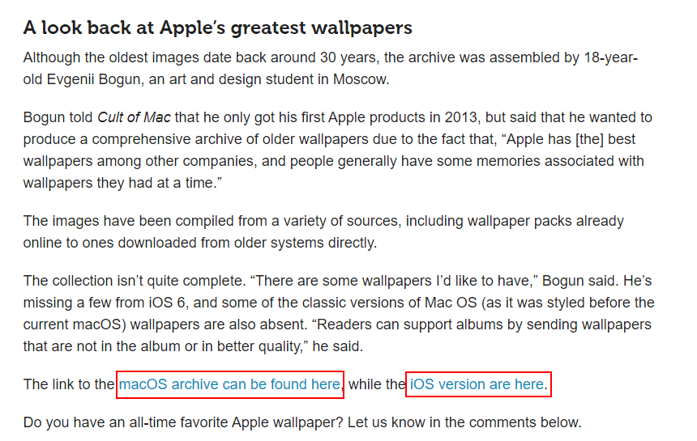

+++
title = "S037《macOS壁纸》获取各世代的macOS壁纸"
description = "直达链接: RYJFNt5GlxJZ90Y6hx0okrVSLKSnmFFbX7j5Mg?key=RV8tSXVJVGdfS1RIQUI0Q3RZZVhlTmw0WmhFZ2V3 Apple作为一家重视设计的科技公司，领军产品mac OS的壁纸一直广受果粉的喜爱，我找到了一个mac OS粉丝建立的壁"
weight = 963
date = "2020-07-07"
categories = ["宝藏网站"]
tags = ["宝藏网站", "资源网站"]
aliases = ["/S037-macOS-wallpaper.md", "/S037-macOS-wallpaper/", "/docs/S037-macOS-wallpaper.md"]
+++

## 直达链接: [https://photos.google.com/share/AF1QipNNQyeVrqxBdNmBkq9ILswizuj-RYJFNt5GlxJZ90Y6hx0okrVSLKSnmFFbX7j5Mg?key=RV8tSXVJVGdfS1RIQUI0Q3RZZVhlTmw0WmhFZ2V3](https://photos.google.com/share/AF1QipNNQyeVrqxBdNmBkq9ILswizuj-RYJFNt5GlxJZ90Y6hx0okrVSLKSnmFFbX7j5Mg?key=RV8tSXVJVGdfS1RIQUI0Q3RZZVhlTmw0WmhFZ2V3)

Apple作为一家重视设计的科技公司，领军产品mac OS的壁纸一直广受果粉的喜爱，我找到了一个mac OS粉丝建立的壁纸合集的博客

https://www.cultofmac.com/565233/heres-almost-every-wallpaper-apple-has-ever-made-for-mac-and-ios/

文章底部留了两个索引，指向google相册，相册一直保持着更新

其中mac OS壁纸的地址为

https://photos.google.com/share/AF1QipNNQyeVrqxBdNmBkq9ILswizuj-RYJFNt5GlxJZ90Y6hx0okrVSLKSnmFFbX7j5Mg?key=RV8tSXVJVGdfS1RIQUI0Q3RZZVhlTmw0WmhFZ2V3

## 展示一部分最新壁纸

![./index.assets/Mac.png)

![./index.assets/MBA2020.png)

![./index.assets/Mac-Pro-macOS-Catalina-Wallpaper.jpg)

![./index.assets/Desktop.jpg)

![./index.assets/macbook-air-201810-gallery4.jpg)

![./index.assets/iMacPro5.png)

## macOS壁纸合集共458张

![./index.assets/macw001.png)

## 打包下载

####  奶牛快传地址（次数有限，先到先得）：

https://zhaooolee.cowtransfer.com/s/cd37abb824d94e

#### 备用百度网盘地址：

链接：https://pan.baidu.com/s/1WSsgTtRdr-qqTU4SIlfa2g   提取码：yzfl

## 小结

Mac的历史比iPhone长很多，翻看Mac的早期壁纸，会给人一种穿越时空的感觉，预览历朝历代的Mac壁纸后，你会发现，**Mac壁纸的审美是一直在线的～***
