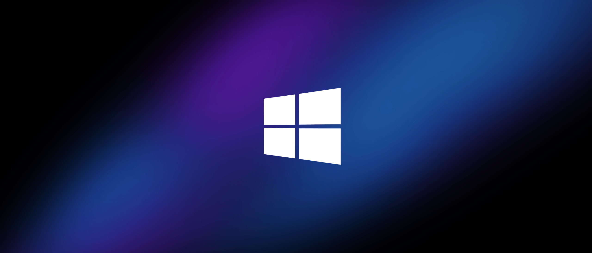
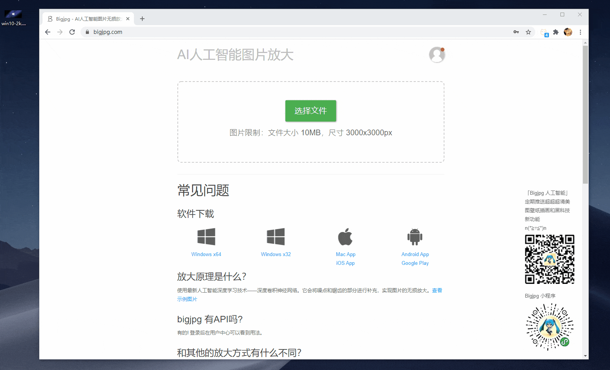
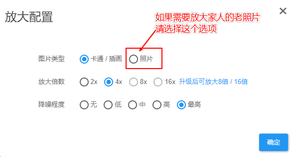
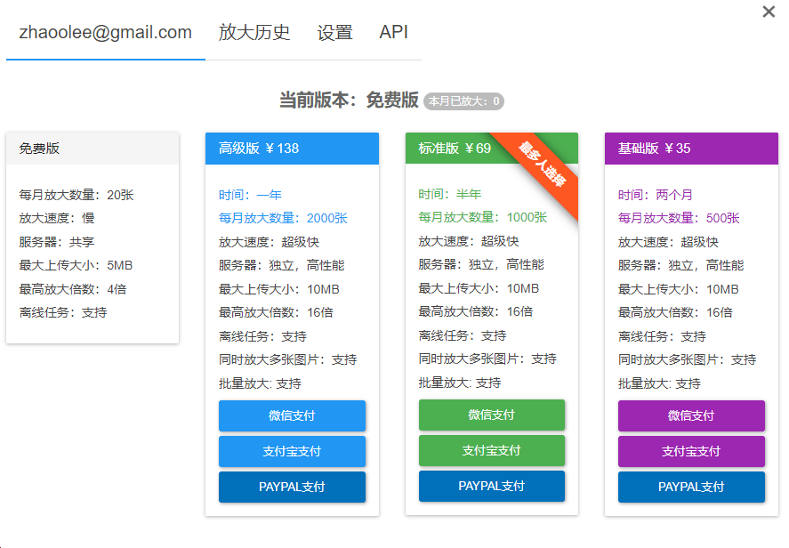

+++
title = "T026《Bigjpg》AI人工智能图片无损放大Win10超酷壁纸(插画,老照片都可以哦~)"
description = "在线直达地址: 先上效果 放大前: Win10 2k壁纸(2560 × 1098) 放大后: Win10 8K壁纸(10240 × 4392) 放大方法 放大配置要选择合适的参数 如果四倍放大不能满足你, 那么充钱使你变强 放大4倍应该已经很够用, 如果一定要放大16, 那充钱就能解决, 有一个省钱"
weight = 974
date = "2020-01-26"
categories = ["在线工具"]
tags = ["在线工具", "效率工具"]
aliases = ["/T026-bigjpg.md", "/T026-bigjpg/", "/docs/T026-bigjpg.md"]
+++

在线直达地址:  [https://bigjpg.com/](https://bigjpg.com/)

## 先上效果

#### 放大前: Win10 2k壁纸(2560 × 1098)

#### 放大后: Win10 8K壁纸(10240 × 4392)

## 放大方法

## 放大配置要选择合适的参数

## 如果四倍放大不能满足你, 那么充钱使你变强

放大4倍应该已经很够用, 如果一定要放大16, 那充钱就能解决, 

有一个省钱小技巧, 比如需要放大一个200*200的照片, 我们可以 先放大2倍再放大4倍,再放大4倍 200 * 2 * 4 * 4 = 6400, 通过三次放大获得6400*6400的照片, 通过多次放大的方式,获得比较理想的尺寸

## 小结

使用PS或PhotoZoom，放大的图片后依然有明显的模糊感，边缘的重影以及噪点。而Bigjpg使用最新人工智能深度学习技术——深度卷积神经网络。它会将噪点和锯齿的部分进行补充，实现图片的无损放大。Bigjpg对于动漫、插画图片的放大几乎可以说是完美的。将小图片放大后，无论是色彩、细节、边缘，效果都很出色。同时也兼容普通的照片放大。
