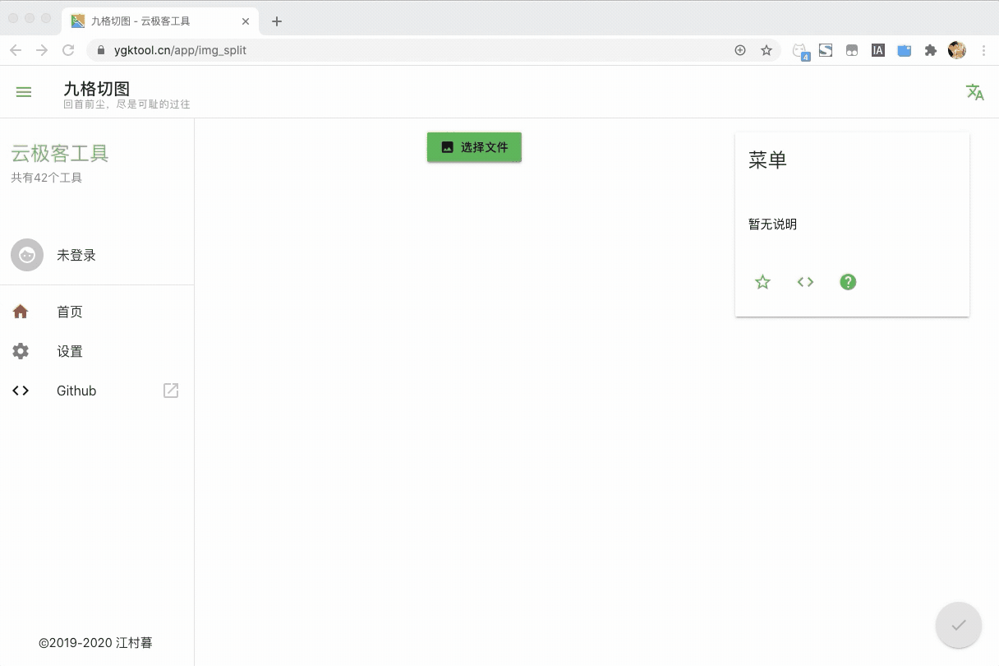
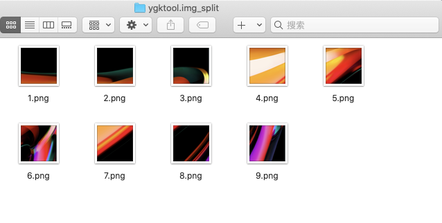

+++
title = "T034《九格切图》在线制作微信朋友圈九宫格切图"
description = "在线直达地址: split 使用教程： 单张上传， 批量下载 切图前 切图后 小结 朋友圈的九宫格切图，是一种有趣的记录生活方式，如果你想制作网页九宫格切图，无需下载App， 打开网页 split 即可完成九宫格制作 写在最后(我需要你的支持) 本文属于 在线工具秘籍 项目《工具类》第34篇, , "
weight = 966
date = "2020-02-03"
categories = ["在线工具"]
tags = ["在线工具", "效率工具"]
aliases = ["/T034-9-img-split.md", "/T034-9-img-split/", "/docs/T034-9-img-split.md"]
+++

####  在线直达地址: [https://www.ygktool.cn/app/img_split](https://www.ygktool.cn/app/img_split)

## 使用教程： 单张上传， 批量下载

## 切图前

## 切图后

## 小结

朋友圈的九宫格切图，是一种有趣的记录生活方式，如果你想制作网页九宫格切图，无需下载App， 打开网页 [https://www.ygktool.cn/app/img_split](https://www.ygktool.cn/app/img_split) 即可完成九宫格制作

## 写在最后(我需要你的支持)

- 本文属于**在线工具秘籍** 项目《工具类》第34篇, , 项目Github地址: [https://github.com/zhaoolee/OnlineToolsBook](https://github.com/zhaoolee/OnlineToolsBook)

- **在线工具秘籍**, 为在线工具写一本优质开源中文说明书,让在线工具造福人类~ 如果你喜欢这个系列, 可以在关注公众号 **0加1** 收到最新的推送

