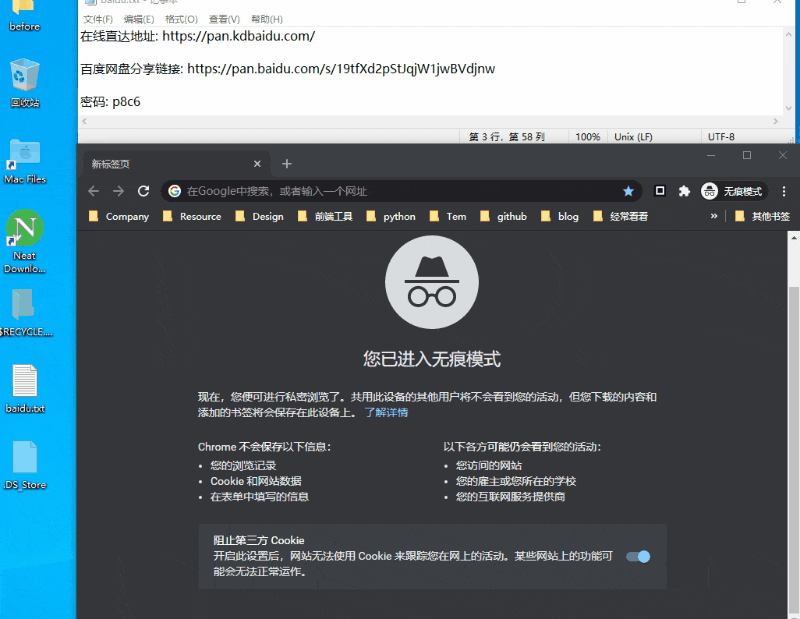
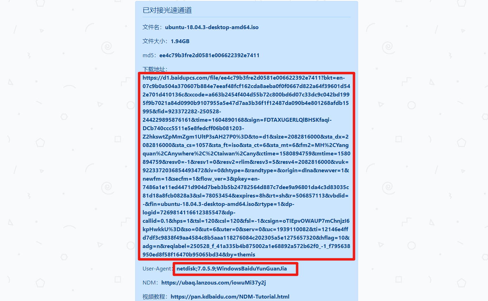
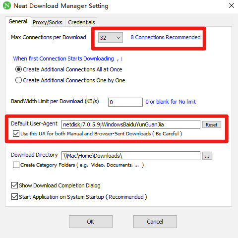
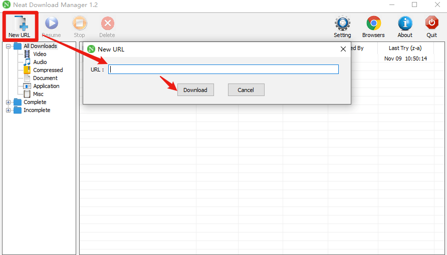
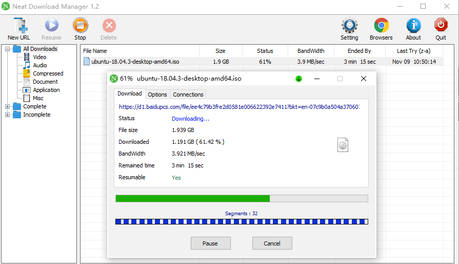
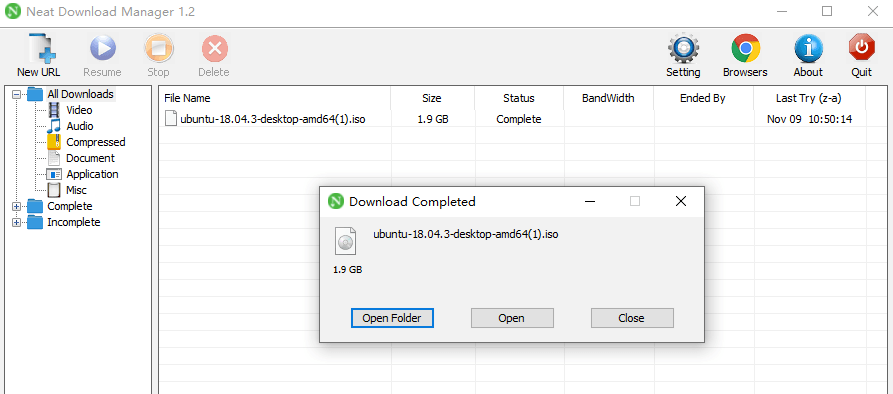

+++
title = "T040《KinhDownload》百度网盘免会员高速下载破解"
description = "在线直达地址: 事前准备 百度网盘分享链接： 密码：p8c6 软件NeatDownloadManager: 通过KinhDownload网页版获取高速下载链接 打开网址 解析获取高速下载地址,和User Agent 打开NeatDownloadManager， 修改User Agent设置，修改线程"
weight = 960
date = "2020-02-09"
categories = ["在线工具"]
tags = ["在线工具", "效率工具"]
aliases = ["/T040-kdbaidu.md", "/T040-kdbaidu/", "/docs/T040-kdbaidu.md"]
+++

####  在线直达地址: [https://pan.kdbaidu.com/](https://pan.kdbaidu.com/)

#### 事前准备

百度网盘分享链接： [https://pan.baidu.com/s/19tfXd2pStJqjW1jwBVdjnw](https://pan.baidu.com/s/19tfXd2pStJqjW1jwBVdjnw)  密码：p8c6

软件NeatDownloadManager: [https://zhaooolee.cowtransfer.com/s/807799020f4445](https://zhaooolee.cowtransfer.com/s/807799020f4445)

#### 通过KinhDownload网页版获取高速下载链接

打开网址 [https://pan.kdbaidu.com/](https://pan.kdbaidu.com/) 解析获取高速下载地址,和User-Agent

打开NeatDownloadManager， 修改User-Agent设置，修改线程为32（线程也可以使用默认8）

#### 使用NeatDownloadManager下载资源

## 下载完成

## 小结

与其忍受20kb/s的下载速度，不如按照以上方法折腾一下，一劳永逸！

本文提到的的User-Agent参数，程序员写爬虫程序才会用到，而百度网盘的限速策略，让全民变成了电脑高手，这种技术普惠性产品，应当载入互联网产品史册！

<video id="video" controls="" preload="none" poster="https://www.v2fy.com/asset/0i/jikemiji/jikemiji-md/2020-11-08-baidu.assets/image-20201111103656268.png">
<source id="mp4" src="https://www.v2fy.com/asset/0i/jikemiji/jikemiji-md/2020-11-08-baidu.assets/baidu-download.mp4" type="video/mp4">
</video>
